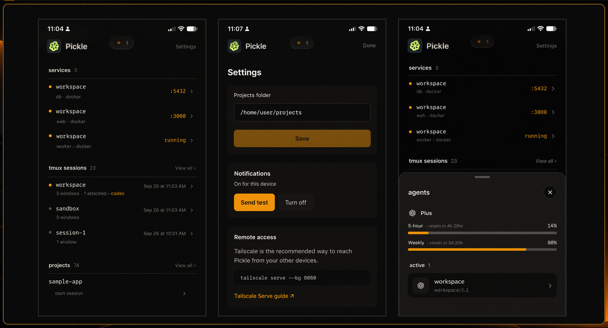
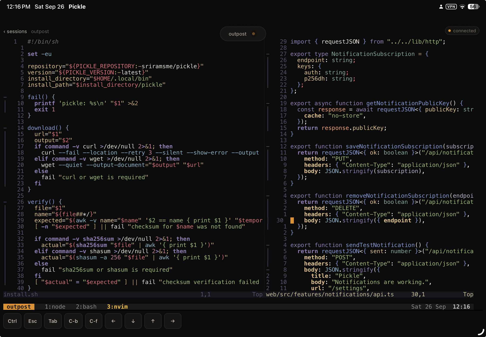

# Pickle

Pickle turns a Linux development machine into a private remote dev lab. Open it
from a laptop, tablet, or phone and use the tmux sessions, shells, Neovim, Codex,
and other tools that already run on that machine.

Your work stays on the host. tmux keeps it alive when the browser closes or the
network drops.



## What it does

- Runs a real tmux terminal in the browser
- Reconnects to persistent sessions
- Lists tmux sessions and local projects
- Shows coding agents running inside tmux panes
- Finds project development servers and Docker Compose services
- Opens HTTP services privately through Tailscale Serve
- Installs as a home-screen app on iPhone and iPad
- Supports opt-in PWA notifications

## Supported setup

Install the Pickle server on a Linux x86-64 or ARM64 machine with tmux. Open it
from any modern browser on Linux, macOS, Windows, iOS, or Android.

Docker is optional. Tailscale is strongly recommended for private remote access.
Windows hosts can run Pickle inside
[WSL2](https://tailscale.com/docs/install/windows/wsl2). Native macOS and Windows
hosts are not supported yet.

## Install

Download and run the installer as your normal user:

```bash
curl -fsSL https://github.com/sriramsme/pickle/releases/latest/download/install.sh -o install.sh
sh install.sh
```

The script verifies the downloaded release, installs Pickle under
`~/.local/bin`, and starts a systemd user service when available. Open the setup
address it prints and choose the folder that contains your projects.

Run the installer again later to update to the latest release.

Use `pickle status` to check the server, `pickle start`, `pickle stop`, or
`pickle restart` to manage it, and `pickle doctor` to check your setup.
`pickle uninstall` removes the installation and keeps your settings;
`pickle uninstall --purge` removes those too. Run `pickle help` for all commands.

## Private access with Tailscale

Install Tailscale using its [Linux guide](https://tailscale.com/docs/install/linux),
connect the host to your tailnet, and run:

```bash
tailscale serve --bg 8080
```

Tailscale prints a private HTTPS address. Open it from another device on the
same tailnet. Its [Serve guide](https://tailscale.com/docs/features/tailscale-serve)
explains the access rules and HTTPS setup.

Do not publish Pickle with Tailscale Funnel. Pickle provides shell and process
access to its host, so treat access to it like SSH access.

## Install on a phone or tablet

Open the private Tailscale address in Safari on an iPhone or iPad, use the Share
menu, and choose **Add to Home Screen**. Pickle opens as a standalone app and
reconnects to the same tmux session when possible.



## Agents and notifications

Pickle recognizes Codex, Claude Code, OpenCode, Pi, and Hermes when they are
running inside tmux. It uses process information only and does not read or save
terminal contents. A running label means the agent process is present; use
`pickle notify` when an agent finishes or needs attention.

After enabling notifications in Pickle's Settings, any local script or coding
agent can send a message through the running server:

```bash
pickle notify "Tests passed and the task is ready for review"
pickle notify --urgency high "Waiting for your approval"
```

When run inside tmux, the command automatically identifies the agent and pane,
adds that context to the title, and opens the relevant session when tapped.

Run `pickle notify --help` for options and examples.

### Let your agents notify you

Enable notifications in Pickle's Settings, then add something like this to your agent's instructions file, such as `AGENTS.md` or `CLAUDE.md`:

```text
Pickle is a self-hosted browser terminal that lets me access this Linux machine
from my other devices. Its CLI can send notifications to my enabled devices.

When running on the Pickle host and the pickle command is available, use
pickle notify when work is ready for review, you are blocked, or you need my input. Keep messages short and specific. Avoid routine progress notifications.
Never include secrets or sensitive information.

Use: pickle notify "<outcome or exact input needed>"
Use --urgency high only when my input is needed to continue.
If notification delivery fails, continue the task and mention the failure in your final response instead of retrying repeatedly.

You can try `pickle help` or `pickle notify --help` to see all options.
```

See [Notifications](docs/notifications.md) for all options and more detailed
agent instructions.

## More

- [Configuration](docs/configuration.md)
- [Development services](docs/services.md)
- [Notifications](docs/notifications.md)
- [Local development](docs/development.md)
- [Security](SECURITY.md)

Pickle is available under the [MIT License](LICENSE).
